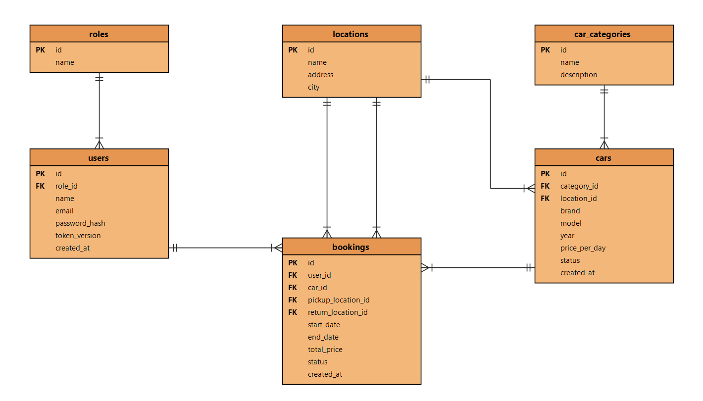

# Car Rental Service


Веб-сервис для аренды автомобилей.

Учебный командный проект.


## Кто чем пользуется

**Пользователь** — смотрит каталог, фильтрует по категории/цене/пункту выдачи, бронирует машину на даты, видит свои брони в кабинете и может их отменить.

**Сотрудник (менеджер/админ)** — ведёт автопарк: добавляет машины, категории, пункты выдачи; видит все брони и меняет их статус при выдаче и возврате машины.

## Что должно работать в MVP

- Регистрация и вход по email/паролю, выход инвалидирует токен
- Каталог машин с фильтрами (категория, пункт выдачи, цена) и признаком доступности на выбранные даты
- Бронирование: машина, даты, пункт получения и возврата, цена считается и фиксируется на сервере
- Нельзя забронировать машину на даты, которые уже заняты другой активной бронью
- Личный кабинет со списком своих броней и отменой
- Админ-часть: CRUD по машинам, категориям, пунктам выдачи; смена статуса брони сотрудником
- Чужая бронь недоступна по прямому запросу id (сервер отвечает 404)
- Пароли только в виде хеша, весь трафик по HTTPS


## Как это устроено

```
React SPA  <—HTTPS/JSON—>  FastAPI  <—SQLAlchemy—>  PostgreSQL
```


## Данные

Шесть таблиц: `users`, `roles`, `cars`, `car_categories`, `locations`, `bookings`. 



- У машины и у брони есть `status`: у машины — `available / rented / maintenance`, у брони — `pending / confirmed / active / completed / cancelled`.
- Отдельного календаря занятости нет — свободна машина или нет, вычисляется запросом: ищем её брони с активным статусом, у которых период пересекается с запрошенным.
- `total_price` брони считается на сервере в момент создания (дни × цена машины в сутки) и сохраняется, а не приходит от клиента.
- Забрать и вернуть машину можно в разных точках — `pickup_location_id` и `return_location_id` у брони независимы.

## Технологии

**Бэкенд** — Python 3.14, FastAPI, SQLAlchemy 2.0, Alembic для миграций, Pydantic v2 для валидации, JWT (PyJWT) + pwdlib/bcrypt для авторизации.

**Фронтенд** — React 19 + TypeScript, Vite, React Router, TanStack Query для запросов и кеша, CSS Modules.

**База и инфраструктура** — PostgreSQL 181, Docker Compose, Nginx на стенде, GitHub Actions для линтеров и тестов.

**Тесты** — pytest + httpx на бэкенде (отдельно проверяем пересечение бронирований и изоляцию чужих данных), Vitest + Testing Library на фронте, ruff/ESLint/Prettier за единым стилем.

## API

Базовый путь — `/api/`

**Авторизация**
`POST /auth/register`, `POST /auth/login`, `POST /auth/refresh`, `POST /auth/logout`

**Профиль**
`GET /users/me`, `PATCH /users/me`

**Каталог**
`GET /cars` — принимает `category_id`, `location_id`, `status`, `min_price`, `max_price`, `start_date`, `end_date` в любой комбинации
`GET /cars/{id}`
`POST /cars`, `PUT /cars/{id}`, `PATCH /cars/{id}`, `DELETE /cars/{id}` — только для сотрудников

**Справочники**
`GET/POST /categories`, `PUT/DELETE /categories/{id}`
`GET/POST /locations`, `PUT/DELETE /locations/{id}`
(запись — только для сотрудников, чтение открыто всем)

**Бронирования**
`GET /bookings` — свои у клиента, все у сотрудника
`POST /bookings` — создание, сервер сам проверяет пересечение дат и считает цену
`GET /bookings/{id}`, `PATCH /bookings/{id}`, `DELETE /bookings/{id}` (отмена)


## Команда

| Имя | Зона ответственности |
|---|---|
| Кривошеев Матвей | тимлид и аналитик —  репозиторий и CI, документация и ER-модель, контракт API, критерии приёмки |
| Ватаншоев Артур | бэкенд — модели, миграции, авторизация, бизнес-логика бронирования и тесты API |
| Байрамов Артём | фронтенд — все страницы, слой `src/api/`, адаптивная вёрстка |
| Авагумян Роман | тестировщик — тест-кейсы, ручная проверка перед мержем в `main`, баг-репорты, граничные сценарии (двойная бронь, чужие данные, некорректные даты) |


